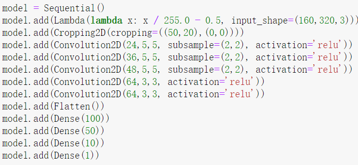

# Behavioral Cloning Project

[](http://www.udacity.com/drive)

Overview
---
This repository contains starting files for the Behavioral Cloning Project.

In this project, you will use what you've learned about deep neural networks and convolutional neural networks to clone driving behavior. You will train, validate and test a model using Keras. The model will output a steering angle to an autonomous vehicle.

We have provided a simulator where you can steer a car around a track for data collection. You'll use image data and steering angles to train a neural network and then use this model to drive the car autonomously around the track.


---

**Behavioral Cloning Project**

The goals / steps of this project are the following:
* Use the simulator to collect data of good driving behavior
* Build, a convolution neural network in Keras that predicts steering angles from images
* Train and validate the model with a training and validation set
* Test that the model successfully drives around track one without leaving the road
* Summarize the results with a written report


[//]: # (Image References)

[image1]: ./examples/placeholder.png "Model Visualization"
[image2]: ./examples/placeholder.png "Grayscaling"
[image3]: ./examples/placeholder_small.png "Recovery Image"
[image4]: ./examples/placeholder_small.png "Recovery Image"
[image5]: ./examples/placeholder_small.png "Recovery Image"
[image6]: ./examples/placeholder_small.png "Normal Image"
[image7]: ./examples/placeholder_small.png "Flipped Image"

## Rubric Points
### Here I will consider the [rubric points](https://review.udacity.com/#!/rubrics/432/view) individually and describe how I addressed each point in my implementation.  

---
### Files Submitted & Code Quality

#### 1. Submission includes all required files and can be used to run the simulator in autonomous mode

My project includes the following files:
* model.py containing the script to create and train the model
* drive.py for driving the car in autonomous mode
* model.h5 containing a trained convolution neural network 
* writeup_report.md or writeup_report.pdf summarizing the results

#### 2. Submission includes functional code
Using the Udacity provided simulator and my drive.py file, the car can be driven autonomously around the track by executing 
```sh
python drive.py model.h5
```

#### 3. Submission code is usable and readable

The model.py uses a Python generator. It contains comments to explain how the codes work. It contains the codes for spliting dataset to train and validate the model.

### Model Architecture and Training Strategy

#### 1. An appropriate model architecture has been employed

I initially followed the video in the classroom to use LeNet model, as a result, the car in the simulator could not drive stably and could not response fast on steering. The car finally went down to the lake. This model is recorded in model_LeNet.ipynb.  After this model, I tried the [nVidia Autonomous Car Group](https://devblogs.nvidia.com/parallelforall/deep-learning-self-driving-cars/) model, after the training of three epochs, the car could drive successfully around the complete circle.

#### 2. Attempts to reduce overfitting in the model

Tring to reduce overfitting in the model, I cut down the number of training epochs from 5 (introduced in class video) to 3. The loss of training set can be countinuously going down. That basically met the requirements of this project. I can run the car pretty well. Because of this, I did not use additional dropout laryers or other methods to further improve the model.
#### 3. Model parameter tuning

The model used an Adam optimizer, so the learning rate was not tuned manually([model.py line 107](model.py#L107)).

#### 4. Appropriate training data

Training data was chosen to keep the vehicle driving on the road. I used the data provided by Udacity, inside of which the center images, left images, right images and steering angles are selected to train the model.

For details about how I created the training data, see the next section. 

### Model Architecture and Training Strategy

#### 1. Solution Design Approach

The overall strategy for deriving a model architecture was to trying different mature models and tune them.

My first step was to use a the LeNet model with 5 epochs to train the center images and steering data given by Udacity. I found that the loss is increasing after the third epoch, which means the overfitting is increasing. Also, in the simulator, the car would run to lake before compeleting a track. Then I add some pre-processing, a 'Lambda' layer was added to normalize the input images to zero means. However, the result showed that this effort did not make much success.

Addtionally, I added cropping layer to cut off some minor features in the images. Then I incorperate left images and right images with corresponding corretion of steering values to the dataset, the result was much better that the car could almost complete a circle. This model is recorded in ([model_LeNet.ipynb](model_LeNet.ipynb)). The visulization of the loss is shown below:


Finally, I choose to use a mofe powerful Deep Neural Network (DNN) model: [nVidia Autonomous Car Group](https://devblogs.nvidia.com/parallelforall/deep-learning-self-driving-cars/). I also added a new layer at the end to have a single output to meet the project requirements. In order to cut down the overfitting, I chose to have 3 epochs instead of 5 epochs. As a result the car in the simulator could successfully complete a full circle without going out. There is just one thing to notice that in a curve the car would violate the lane line on the left side, but could recover back. I am wondering if it is beacuse the correaction value of steering angles of left images and right images are set too high as 0.2 in this study. Thus, I set the correction value to 0.23 and then, the car could response more quickly in curving and not pop up onto ledges. 
#### 2. Final Model Architecture

The final model architecture (model.py lines 85-97) consisted of a convolution neural network with the following layers and layer sizes:




#### 3. Creation of the Training Set & Training Process

For the first time, I merely used center images to build the dataset. Then I added left images and right images, of course, the measurements data is added with the generated corresponding corrections. Also the images are fliped, the measurements are multiplied by -1 to augment the dataset. 

After this, the dataset was splited to train set (0.8) and validation set (0.2). 
* Train samples number : 19286
* Validation samples number : 4822

The data then was shuffled randomly to be inputted to the model. The trainning procedure and the history of loss are shown below:


We can see that this model did a better job than the former one.